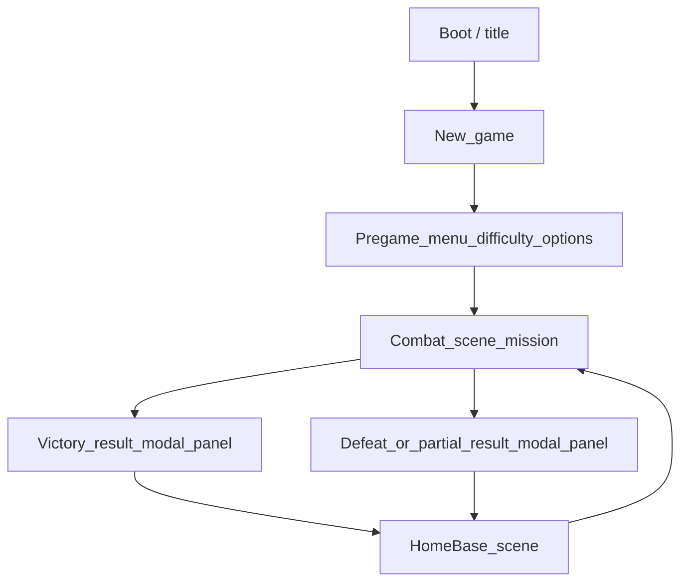
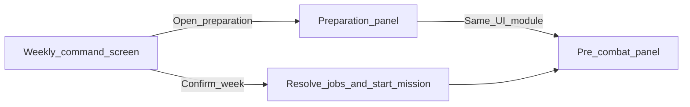

# Balancing abilities vs weapons (living design doc)

## Design intent

The goal is **not** “stop the player from spamming” as an end in itself. The goal is **interesting tradeoffs and situational choices**: different fights, loadouts, and resource states should shift what’s *good*, so there is no single move that is **obviously always right**. Repeated use of the same tool can be fine when the situation calls for it; the systems should make **when to lean on abilities vs weapons vs movement** a real question.

Constraints (cooldowns, per-battle caps, carried fuel, stamina, etc.) are levers to **create those shifting pressures**, not punish repetition for its own sake.

---

## Game loop (scenes & flow)

Sketch of how screens chain together. **ASCII wireframes** for town / weekly UI are in **[UI wireframes (town & preparation)](#ui-wireframes-town--preparation)** (next section—easy to find), including **mission end modals**.



1. **Title** → player chooses **New game** (or load).
2. **Pregame menu:** difficulty and global options (brief; not character creation unless you add it later).
3. **First mission:** load **combat scene** directly (or via a one-line staging screen).
4. **Mission end — victory or failure:** use **modal panels** (not thin banners). Each summarizes **casualties** (dead, wounded, retreated, morale/affliction changes), **objectives completed vs failed** (and optional bonus goals), **loot** and **experience** where applicable. Primary action: **[ Continue to base ]** → loads **`HomeBase`** scene (`Assets/Scenes/HomeBase.unity`). Same shell for both outcomes; copy and accent (title, icon) differ so “clear win” vs “costly win” vs “failed but survived” read correctly.
5. **Not a full wipe:** **not necessarily game over.** After the modal, the run continues with **survivors** from the mission (including **manual / morale retreat**) **plus** everyone who stayed in town. The modal is the beat where the player **absorbs** losses and objective state before returning to base management—not a separate town-only summary.
6. **Home base scene (`HomeBase.unity`):** weekly **roster**, **base assignments**, **mission pick (~3)**, **loadout / stash** (same prep UI as combat). **Confirm week** → load **combat scene** for the chosen mission.
7. Loop **HomeBase ↔ Combat** for the campaign.

### `PlayerParty` / roster model

- **Single roster** holds **all** recruited `CharacterSheet`s (town + field), not only the active squad.
- **Per-character flag** (name TBD: e.g. `joinsNextCombat`, `onExcursion`, `inNextMissionSquad`): **true** only for heroes selected for the upcoming mission. Combat spawn / `TurnManager` should only instantiate or activate flagged members (exact pattern TBD against current [`PlayerParty`](Assets/Scripts/GameState/PlayerParty.cs) spawn flow).
- **Stash** is party-level or base-level inventory; excursion members pull from it in **Preparation** (see wireframe).

### Retreat (two paths)

- **Manual retreat:** player moves a unit to a **map edge** (or uses a **Retreat** command) to **extract that character** from the fight; they count as **survivors** for post-battle continuation and keep carried inventory state you define.
- **Morale collapse (if implemented):** at **0 morale**, automatic pathing to edge and exit (as in morale brainstorm)—**distinct** from voluntary retreat so UI can explain stakes.

---

## UI wireframes (town & preparation)

Low-fidelity **ASCII layouts** (use a monospace font / raw view if boxes look misaligned). Same content is summarized in [Between-mission meta (base & roster)](#between-mission-meta-base--roster).

### Weekly command screen (town)

```text
+------------------------------------------------------------------------------+
|  Week  [ 12 v ]     Gold: 840    Roster: 7/8          [ Confirm week ]       |
+------------------------------------------------------------------------------+
|  CHOOSE MISSION (1)                         |  EXCURSION SQUAD (max 4)         |
|  +---------+ +---------+ +---------+       |  +----+ +----+ +----+ +----+      |
|  | Bog     | | Convoy  | | Ruins   |       | | A  | | B  | | C  | | D  |      |
|  | decay   | | escort  | | loot+   |       | |slot| |slot| |slot| |slot|      |
|  | reward..| | ...     | | ...     |       | +----+ +----+ +----+ +----+      |
|  +---------+ +---------+ +---------+       |  (drop roster portraits here)     |
|  [ selected card detail + hazard icons ]   |  [ Open preparation / loadout ]  |
+-------------------------------------------+----------------------------------+
|  ROSTER (draggable)     Alice   Bob   Carol   Dan   Eve   Frank   Gia           |
|  (ghost if already in squad)                                                    |
+------------------------------------------------------------------------------+
|  BASE THIS WEEK          For each hero NOT in squad:  [ Room / task v ]         |
|  Build: Workshop L2 (2/3)  -- Alice: Workbench (craft)                          |
|  Operate: Altar, Infirm..  -- Eve: Prayer altar    Frank: Barracks (rest)      |
+------------------------------------------------------------------------------+
|  [ Recruit ] (disabled if full)     [ Stash summary ]    Quick: heal / afflict? |
+------------------------------------------------------------------------------+
```

### Preparation / loadout (modal; reuses combat inventory + character sheet)

```text
+------------------------------------------------------------------------------+
|  Preparation                                      [ Squad: A v B C D ]  [ X ] |
+------------------------------------------------------------------------------+
|  +-----------------------------+  +----------------------------------------+ |
|  | STASH (shared)              |  | SELECTED HERO -- same as combat panel   | |
|  | [grid of stash slots]       |  | Portrait, HP/morale, stats, equipment  | |
|  |                             |  | [grid: hero inventory + equip slots]   | |
|  |  drag item ----------------------->  hero  |  <--------------------------  | |
|  +-----------------------------+  +----------------------------------------+ |
|  [ Learn skill: scroll / manual / blueprint on this hero ]  (opens picker)   |
+------------------------------------------------------------------------------+
```

### Town prep flow (diagram)



### Mission end — victory / defeat modal (not banners)

Overlay **modal panel** on combat scene (or full-screen dimmed backdrop). **Do not** rely on top-of-screen banner text alone—players need a stable place to read **casualties** and **objectives** before leaving.

```text
+------------------------------------------------------------------------------+
|  MISSION RESULT:  Victory  (or: Pyrrhic win / Defeat / Abandoned)            |
+------------------------------------------------------------------------------+
|  OBJECTIVES                                                                   |
|    [x] Primary: Secure the relay                                              |
|    [ ] Optional: No casualties                                                |
|    [x] Extract with the package                                             |
+------------------------------------------------------------------------------+
|  CASUALTIES & STATUS                                                          |
|    KIA:   Bob                                                                 |
|    Wounded / injured: Alice (will recover), Carol (affliction: Fear)         |
|    Retreated: Dan (extracted Turn 8)                                          |
|    Unharmed: Eve                                                              |
+------------------------------------------------------------------------------+
|  REWARDS (if any)     Loot: [...]     XP: +120 party / per-hero breakdown     |
+------------------------------------------------------------------------------+
|                        [ Continue to base ]                                   |
+------------------------------------------------------------------------------+
```

- **Continue** is the only required control (optional **Review combat log** later). Both **hard fail** and **partial success** use this layout; **loot/XP** sections can be dimmed or omitted when nothing was earned.
- **HomeBase** scene loads only after **Continue** (or equivalent); no auto-skip.

---

## Current codebase anchors

- **AP** refill per turn from speed (`MoveSpeed()` in [`CharacterSheet`](Assets/Scripts/RPG/CharacterSheet.cs)); multiple actions per turn are expected.
- **Mana pool** (`currentMana`, `MaxMana()` from willpower) + [`ActionValidator`](Assets/Scripts/CombatScene/helpers/ActionValidator.cs) checks exist, but **`MANA_COST` is not wired from [`AbilityData.manaCost`](Assets/Scripts/RPG/Content/AbilityData.cs)** and **mana is not spent on resolve** yet—implement one unified “pay costs” path when you build this for real.
- **Inventory** supports stackable items with [`weight`](Assets/Scripts/RPG/Inventory/InventoryItem.cs); carry limits vs strength are not fully enforced end-to-end yet.

---

## Three ability themes (brainstorm — primary model)

Abilities are tagged with a **resource theme**. Most classes use **one theme**; some classes may **blend two** (e.g. magic + gadget), which increases loadout complexity but supports hybrid fantasy.

### 1. Magic

- **Fuel:** Mana crystals (or similar), **inventory stackables**: moderate **weight**, **higher unit cost** (expensive to stockpile).
- **Efficiency scaling:** Higher **willpower reduces mana cost** of magic abilities (flat reduction, percent discount, or stepped tiers—pick one formula for predictability).
- **Feel:** Spells are strong; you feel the limiter when crystals run low mid-mission.

### 2. Gadget

- **Fuel:** Tech components (stackable), **cheap per use** but **somewhat heavy**—trades **carry capacity** for sustained gadget use.
- **Efficiency scaling:** (Open design knob—examples: intellect for “tuning”, perception for “precision”, or no stat discount and pure loadout game.)
- **Feel:** Less burst than magic per activation if desired, but you can bring *more* uses if you accept weight.

### 3. Physical (martial techniques)

- **Fuel (option A — stamina):** **Stamina** — a **per-character resource** for the battle (or per-encounter refresh rule), **scaled by willpower** (pool size and/or regen per turn).
- **Fuel (option B — morale):** See **[Morale (refined brainstorm)](#morale-refined-brainstorm)** below: shared pool, mission/map-dependent pressure, mental damage as main threat.
- **No inventory weight** for the fuel itself (unless you later add “adrenal kits” as optional boosts).
- **Feel:** Competes with weapons on the same “body” budget; spend makes **when** to use a technique vs a plain attack a real choice as the fight evolves.

**Willpower’s dual role (stamina branch):** It both **shrinks magic costs** and **feeds the physical stamina pool**. That’s coherent if you frame willpower as focus/endurance; if builds feel too samey, later split into two stats or gate one theme behind a different stat. **Morale branch** can use a different max-pool scaling (e.g. willpower + class) so magic efficiency and morale tankiness don’t have to stack identically.

---

## Cross-theme balance (high level)

| Theme   | Scarcity shape        | Loadout pressure      | Typical lever vs weapons      |
|---------|------------------------|------------------------|-------------------------------|
| Magic   | Finite carried crystals | Weight + gold/rarity   | High impact per cast          |
| Gadget  | Finite components      | **Weight** (heavy stacks) | Volume / utility            |
| Physical| Stamina *or* Morale    | None (stat-based); Morale adds map/mission rules | Techniques vs plain attacks; Morale adds psychology / tempo |

**Cross-theme pacing:** Optional **per-ability cooldowns** and/or **per-battle caps** on the biggest effects can reinforce *situational* peaks (e.g. holding AoE for a clump) rather than one universal answer—especially relevant because **multi-AP turns** allow chaining several actions in one round. Use them when they add meaningful **“now vs later”** or **“this fight vs next”** tradeoffs, not as a blanket anti-repeat rule.

---

## Class design

- **Default:** One theme per class (all abilities share that theme’s fuel).
- **Hybrid classes:** Allow **two themes** on one character; abilities must declare theme so UI and validators know which pool/item to debit.
- **Blending cost:** Optional rule—hybrids pay slightly higher costs or lower caps so pure specialists stay distinct.

---

## Enemies

- **Auto batteries / mana:** Enemies do **not** use the same inventory logistics as PCs. Give them **infinite or generous combat pools** per theme (or scripted per-encounter caps) so AI stays simple and fair.
- **Implementation sketch:** `CharacterSheet` flag or `CombatResourceProfile` (player vs NPC): NPCs use internal counters that refill or are set per encounter; PCs use inventory-derived snapshots at combat start.

---

## Morale (refined brainstorm)

**Intent:** Optional **replacement or parallel layer** for martial “fuel” and/or a **global combat psychology** meter for both PCs and enemies. Supports **situational** pressure without a universal hidden timer on every map.

### Map- and mission-dependent passive decay

- **Passive morale decay applies only on certain map / mission types** (e.g. cursed forest, radioactive wasteland, infested bog). Other themes have **different** hazards (environmental damage, vision, spawn pressure, etc.) so choosing among **~3 offered missions** is a real **risk/reward** choice—not just difficulty tier.
- **Decay magnitude stays small** relative to fight-defining events; it nudges tempo on those maps rather than dominating every turn.

### Sources of morale change (priority order)

1. **Largest drops:** **Mental / morale-targeting** attacks and effects (enemy abilities, fear, domination-adjacent debuffs, etc.).
2. **Secondary drops:** **Taking damage**, **ally death** (and similar narrative beats you want to weight).
3. **Small costs:** **Martial / physical abilities** pay a **minor** morale cost so techniques are a slight trade vs basic weapon swings—not the main drain.
4. **Gains:** **Downing foes**, **finding loot** (or objective milestones), plus **active recovery** (e.g. spend AP with cooldown; ally “rally” with AP + cooldown) as discussed in earlier brainstorming.

### Other knobs (carry over from prior morale discussion as needed)

- **Below half max morale:** apply a **random psychiatric / stress affliction** (Darkest Dungeon–style: fear, paranoia, abusive, selfish, etc.—exact list is content). **Not** a single fixed debuff; random choice increases variety and replay tension. **Recovery** can tie to base facilities (barracks, prayer altar), time between missions, or specific cures—define whether afflictions persist across missions or clear on return.
- **Zero morale:** **forced retreat** to map edge and exit (see **Retreat** in [Game loop](#game-loop-scenes--flow))—tune so this follows from **big swings** (mental hits, casualties) more than from passive nibbling on decay maps. **Player-initiated retreat** uses the same extraction idea but is chosen, not automatic.
- **Enemy morale** can be attacked as a **tactic** on builds that invest in it; bosses/elites may need **resistance floors** so the axis stays optional, not mandatory.

### Design fit

- **Aligns with design intent:** Different **mission types** change which constraints bind (decay maps vs clean battlefields vs economic hazards), so the “right” approach **varies by situation**.
- **Content cost:** Each map theme needs **defined rules** (morale decay yes/no, rates, other modifiers). Mission picker UI must surface **theme consequences** clearly so choices are informed.

---

## Between-mission meta (base & roster)

**Cadence:** Each **week** (or equivalent turn), the player **picks one mission** from a **short list** (~3 options with distinct map themes / hazards) and **assigns every hero** to either **the excursion** or **the base**.

### Excursion squad

- **Squad size** varies by mission contract or story phase (e.g. **~4 at game start**); cap is a **design + UI** constraint (slots on mission screen).
- Excursion members take **carried loadout**; everything else lives in **stash** (see below).

### Heroes not on the mission

- Each stay-home hero is assigned to **build/upgrade a room** *or* **use an existing room** for its benefit (same roster can’t be in two places—clarify in UI: “assign to construction” vs “assign to operate/use”).
- **Tradeoff:** Bodies on the mission vs **base progress** vs **healing/crafting**—another layer of “no single obvious choice.”

### Base rooms (starter + specialized)

| Room | Role (brainstorm) |
|------|-------------------|
| **Equipment stash** | Stores **items not taken** on the mission; central pool for re-equip between excursions. |
| **Hero barracks** | **Slow** passive **HP + morale** recovery between missions for heroes resting there (or global if barracks is “idle default”). |
| **Workbench** | **Tech / gadget** line: upgrade or **combine** tech items (recipes, costs TBD). |
| **Enchanting foyer** | **Magic** line: upgrade or **combine** magic items. |
| **Infirmary** | **Faster HP** healing than barracks (assign hero or consume charges?). |
| **Prayer altar** | **Faster morale** healing and/or **affliction** mitigation (pairs with random sub-50% morale ailments). |
| *(future)* | More rooms expand the same pattern: **assign hero → progress or buff**. |

### Recruitment

- **New heroes** can be recruited if **roster below capacity**; capacity is a **base upgrade** or story gate. Ties into “who sits out this week” pressure as roster grows.

### UI scope (single meta screen or wizard)

1. **Mission select:** Show ~3 missions with **visible hazards** (morale decay biome, other modifiers, rewards sketch).
2. **Squad picker:** Drag or slot heroes into **excursion** (up to mission limit); remainder available for base.
3. **Base assignment:** For each non-excursion hero, pick **room task** (build X, use workbench, rest in infirmary, etc.)—must respect **room capacity** (one hero per station per week, or parallel queues—decide in implementation).
4. **Loadout / stash:** Open **preparation** UI: pick **one excursion member** (or cycle roster), move items **between that hero’s inventory and stash** (and equipment slots as today). Same UX as combat inventory.
5. **Skill learning:** From prep or a dedicated base action, consume **one** skill-teach item on **one** assigned hero (see below).

### Between-mission UI wireframe (draft)

**ASCII layouts and mermaid flow** are kept in one place: **[UI wireframes (town & preparation)](#ui-wireframes-town--preparation)** (near the top of this file) so they are easy to spot in the editor.

Rules of thumb: **desktop-first** layout (stacks on narrow view); **Confirm week** disabled until a mission is chosen, squad size is valid, and every hero has a **base job** or is on the squad.

### Skill-teach items (one system, three skins)

- **Single code path:** One consumable type (e.g. `SkillTeachItem` or shared handler) with parameters: **ability id**, **prerequisites**, **consumed on success**. Presentation only differs:
  - **Spell scroll** → magic flavor icon/copy
  - **Maneuver manual** → physical flavor
  - **Technical blueprint** → tech flavor
- **When:** Between missions (prep panel or room action); optionally restrict “must be assigned to enchanting foyer / workbench / barracks” for fantasy—**not required** for code reuse.
- **UX:** Hero selected → **Use teach item** → list compatible scrolls in stash/inventory → confirm → grant `AbilityData` / known ability, destroy item, show result toast.

### Reuse combat UI for preparation and pre-battle

- **Goal:** One implementation of **inventory grid + equipment + character stats** ([`CombatPanelUI`](Assets/Scripts/UIPanels/CombatPanelUI.cs) + [`InventoryUIManager`](Assets/Scripts/UIPanels/Inventory/InventoryUIManager.cs) + stats block), driven by a **context**:
  - **Combat:** current turn character, party in scene, no stash column *or* stash hidden.
  - **Meta prep:** selected excursion member, **second grid = stash** `Inventory`, drag-drop between stash and hero.
  - **Pre-combat (mission start):** same as meta prep if you run it in combat scene before `TurnManager` starts—**same views**, different data sources wired the same way.
- **Refactor direction:** Extract a **shared** `CharacterLoadoutView` (or rename) that takes `CharacterSheet`, optional `Inventory stash`, and flags `showStash`, `readOnly`, `allowLearnSkill`; host it from both weekly prep and combat tab.

### Links to combat systems

- **Morale** recovery and **affliction** removal at base reduce pure RNG feel if missions go badly.
- **Magic vs gadget** split matches **enchanting foyer vs workbench**—reinforces theme fantasy in the meta loop.

---

## Implementation todos (when executing)

1. Add **theme + cost** to content (`AbilityData` or parallel field): `Magic | Gadget | Physical`, base costs, optional cooldown/charges.
2. **Pay costs** in one place on successful ability resolution; wire **theme** to: consume crystals / components / stamina.
3. **Pre-battle / expedition:** Snapshot or lock carried consumables into combat pools so mid-fight inventory changes do not desync.
4. **UI:** Show HP (red), and **per-theme or merged** secondary bars for stamina + “carried fuel” remaining for the fight.
5. **AI:** Filter candidate actions by theme-specific affordability (mirror [`EnemyController`](Assets/Scripts/CombatScene/Controllers/EnemyController.cs) AP checks).
6. **Morale (if adopted):** Data on **mission/map type** (passive decay rules, other hazards); hook **morale deltas** into damage pipeline, death events, mental effects, loot/kill rewards; **affliction** table + roll when crossing **50% max morale**; UI for mission select and in-combat morale.
7. **Meta loop:** Roster capacity, **base room** state (build levels, queues), **weekly** resolution (missions + assignments), **stash** vs **excursion inventory**; UI per **wireframe** (mission cards, squad slots, base assignments, preparation modal).
8. **Shared UI module:** Refactor [`CombatPanelUI`](Assets/Scripts/UIPanels/CombatPanelUI.cs) inventory/stats into a **reusable loadout presenter** used by **weekly prep**, **pre-combat gate**, and **combat inventory tab** (stash column only where needed).
9. **Skill-teach items:** One data/code path for teach consumables; three **cosmetic** item families (scroll / manual / blueprint) → same learn pipeline + `CharacterSheet` ability unlock.
10. **Scenes & flow:** `Title` → `Pregame` → `Combat` ↔ **`HomeBase`** (`HomeBase.unity`); **mission result modal panels** (casualties, objectives, loot/XP) with **Continue to base**—not banners; **`PlayerParty`** roster + **join-next-combat** flag; **manual retreat** + morale retreat; post-battle state merge survivors + town roster.

---

## Earlier ideas retained (optional layers)

- **Per-ability cooldown** + **inventory fuel** remains a strong combo when it creates **loadout vs encounter** tension, not only to block repetition.
- Extra ideas that change *which* constraint binds: same-turn strain, focus/concentration, heat meters, delayed telegraphed AoE, per-school ammo pools—each can make different situations favor different tools on top of the three themes.
